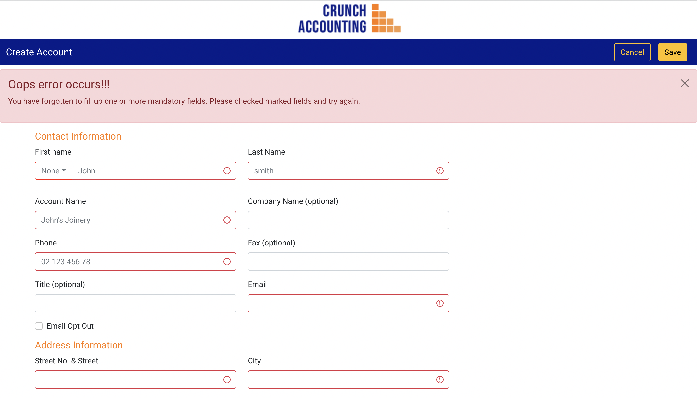

# Crunch Accounting

_Reactjs app for Crunch Accounting to enter client's information._

### [Access live in sandbox](https://codesandbox.io/s/crunch-accounting-5x214b)

## Installation

First of all, clone project,

- git clone [https://github.com/bhu1oja/crunch_accounting](https://github.com/bhu1oja/crunch_accounting)

Then all the packages need to be install:

- run `npm i -- save`.
- run `npm start`

## Run test

To run test files,

- run `npm test`

## Build project

To build app for production

- run [`npm run build`](https://reactjs.org/docs/optimizing-performance.html#use-the-production-build)

## Package used

- [react-bootstrap](https://react-bootstrap.github.io/)
- [react-select](https://react-select.com/home)
- [react-icons](https://react-icons.github.io/react-icons/)

## Screenshots of App

### Developed by [Bhupendra Ojha](http://bhupendraojha.engineer/)
